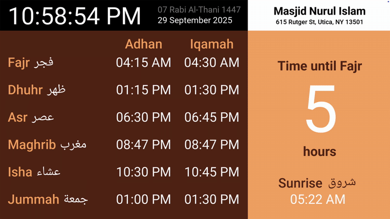
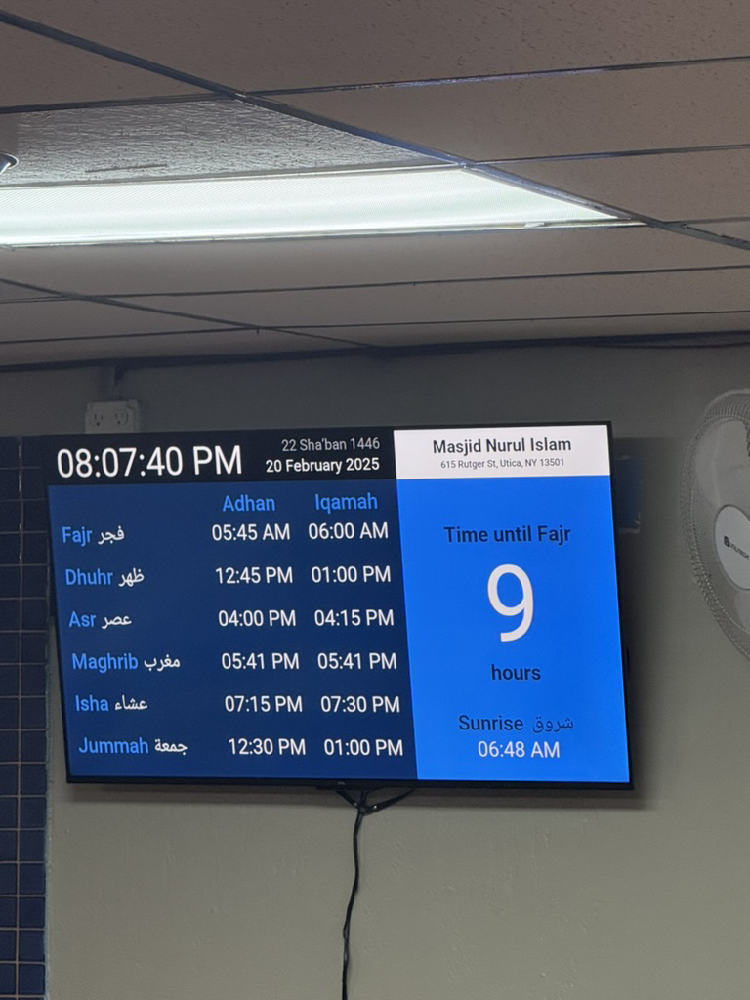

## Masjid Prayer Time Display (Pygame)



*A demonstration of the application's dynamic UI, including the live countdown and theme cycling*



*The display in daily use at Masjid Nurul Islam.*

### Description

A robust, dynamic prayer time display application developed in Python/Pygame. This system is structured for stable, local operation in environments with limited or no internet access, making it a reliable digital solution for Masjids.

### Project Story

This project was born out of a practical need at my local community mosque, Masjid Nurul Islam. The goal was to replace a manual whiteboard, which required daily updates by hand, with a reliable, automated display that could run 24/7 without depending on an unreliable internet connection.

I developed this application from the ground up using Python and Pygame to provide a clear, easy-to-read display for daily prayer times, Iqamah countdowns, and important announcements. The system was designed to be operated by volunteers with minimal technical knowledge, using a simple CSV file for all time updates. It has been in continuous daily use since its deployment, serving as a core piece of the masjid's daily operations.

### Technical Highlights & Problem Solved

- **Offline-First Architecture**: Solved the core constraint of no internet by designing the system to parse all data from a local `prayer_times.csv` file, ensuring 100% uptime and reliability.
- **Dynamic UI with Pygame**: Leveraged the Pygame library to build a custom, scalable graphical interface from the ground up, optimized for clarity and distance viewing.
- **Complex Text Rendering**: Integrated `arabic-reshaper` and `python-bidi` to correctly process and render right-to-left Arabic text, demonstrating experience with internationalization (i18n).
- **Stateful Time Management**: Implemented robust logic to track prayer events, calculate countdowns to the next event, and manage time-based state changes throughout the application.
- **Configuration Management**: Built a settings system that loads from `settings.json` on startup and can be modified in real-time via keyboard inputs, with changes persisted on exit.

### Technologies and Dependencies
- **Language**: Python
- **Libraries**: Pygame, arabic-reshaper, python-bidi, hijri-converter
- **Data**: CSV (Comma Separated Values)
- **Tools**: Command Line (Batch File for one-click deployment)

### Asset Attribution and Licensing
The following external assets are used under their respective open licenses, demonstrating adherence to best practices for asset licensing:

- **Sound Effect** (`adhan.wav`): Sourced from [Pixabay](https://pixabay.com/sound-effects/beep-125033/) and licensed under the Pixabay Content License.
- **Fonts**:
    - **Noto Naskh Arabic**: Used for `arabic.ttf`. Sourced from [The Noto Project](https://github.com/notofonts/arabic) and licensed under the SIL Open Font License (OFL).
    - **Roboto**: Used for `bold.ttf`, `medium.ttf`, and `regular.ttf`. Sourced from [The Roboto Project Authors](https://github.com/googlefonts/roboto-classic) and licensed under the Apache License, Version 2.0.

### Future Development Plans
While the current system is intentionally offline-first for maximum reliability, the next major feature will focus on simplifying the data update process for volunteers:

- **Remote Configuration Utility**: Develop a separate, lightweight utility script that can automatically retrieve current prayer times via a public API or calculation library (like pyislam) and generate the correct prayer_times.csv file on a separate, internet-enabled computer.
- **Mobile-Friendly Updates**: Explore packaging the update utility into a simple web interface (using a framework like Flask or Node.js) to allow authorized staff to generate and upload the new CSV file remotely without touching the local machine.

### Controls
The application can be controlled using the following keyboard inputs:

*   **`ESC`**: Quit the application.
*   **`TAB`**: Reload the prayer times from the `prayer_times.csv` file.
*   **`LEFT`/`RIGHT` Arrow Keys**: Cycle through the color themes.
*   **`SPACE`**: Toggle the visibility of the Eid announcement message.
*   **`1` / `2`**: Decrease/increase the font size of the Gregorian date.
*   **`3` / `4`**: Decrease/increase the font size of the Islamic date.
*   **`5` / `6`**: Decrease/increase the font size of the Eid announcement.
*   **`BACKSPACE`**: Reset all settings to their default values.

### Installation Guide
This guide assumes you have Python installed and correctly added to your system's PATH.

1. **Clone the Repository**:
   ``` bash 
   git clone https://github.com/ohzai17/MasjidPrayerTimeDisplay.git
   cd MasjidPrayerTimeDisplay
   ```
2. **Install All Dependencies**:
   ``` bash
   pip install -r requirements.txt
   ```
3. **Execution**: The core application is run directly via the command line, though a helper batch file is included `launch.bat` for end-user deployment convenience:
   ``` bash
   python src/main.py
   ```

### Testing

Manual validation performed on the deployment machine at Masjid Nurul Islam and on a local development machine:

- Installed dependencies: `pip install -r requirements.txt`
- Ran the app: `python src/main.py` — verified fullscreen display, today's prayer times, Hijri date, and countdowns.
- Confirmed keyboard controls (ESC, TAB, arrows, SPACE, 1–6, BACKSPACE) behave as documented.
- Confirmed CSV reload (edit `src/assets/prayer_times.csv` then press TAB) and that the adhan sound plays when expected.

### License
This project is licensed under the MIT License - see the [LICENSE](LICENSE) for details.